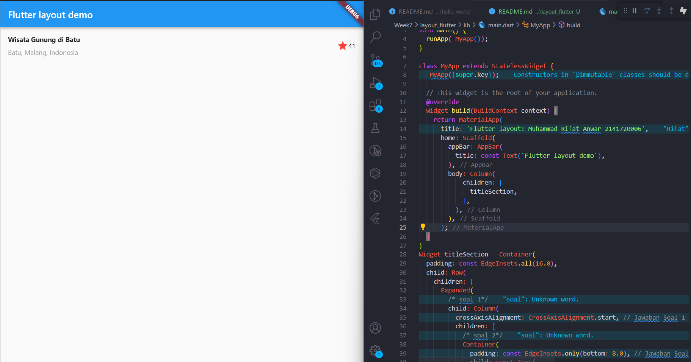

# 3. Praktikum 1: Membangun Layout di Flutter

# Langkah 1: Buat Project Baru
Buatlah sebuah project flutter baru dengan nama layout_flutter. Atau sesuaikan style laporan praktikum yang Anda buat.

# Langkah 2: Buka file lib/main.dart
Buka file main.dart lalu ganti dengan kode berikut. Isi nama dan NIM Anda di text title.

import 'package:flutter/material.dart';

void main() => runApp(const MyApp());

class MyApp extends StatelessWidget {
  const MyApp({super.key});

  @override
  Widget build(BuildContext context) {
    return MaterialApp(
      title: 'Flutter layout: Nama dan NIM Anda',
      home: Scaffold(
        appBar: AppBar(
          title: const Text('Flutter layout demo'),
        ),
        body: const Center(
          child: Text('Hello World'),
        ),
      ),
    );
  }
}

# Langkah 4: Implementasi title row
Pertama, Anda akan membuat kolom bagian kiri pada judul. Tambahkan kode berikut di bagian atas metode build() di dalam kelas MyApp:

Widget build(BuildContext context) {
    Widget titleSection = Container(
  padding: const EdgeInsets.all(16.0),
  child: Row(
    children: [
      Expanded(
        /* soal 1*/
        child: Column(
          crossAxisAlignment: CrossAxisAlignment.start, // Jawaban Soal 1
          children: [
            /* soal 2*/
            Container(
              padding: const EdgeInsets.only(bottom: 8.0), // Jawaban Soal 2
              child: const Text(
                'Wisata Gunung di Batu',
                style: TextStyle(
                  fontWeight: FontWeight.bold,
                ),
              ),
            ),
            Text(
              'Batu, Malang, Indonesia',
              style: TextStyle(
                color: Colors.grey[500], // Jawaban Soal 2 (Anda dapat menyesuaikan warna sesuai keinginan)
              ),
            ),
          ],
        ),
      ),
      /* soal 3*/
      Icon(
        Icons.star, // Jawaban Soal 3 (Anda dapat mengganti dengan ikon yang Anda inginkan)
        color: Colors.red, // Jawaban Soal 3 (Anda dapat mengganti warna sesuai keinginan)
      ),
      const Text('41'), // Jawaban Soal 3 (Anda dapat mengganti teks sesuai keinginan)
    ],
  ),
);

# 4. Praktikum 2: Implementasi button row

# Langkah 1: Buat method Column _buildButtonColumn
Bagian tombol berisi 3 kolom yang menggunakan tata letak yang sama—sebuah ikon di atas baris teks. Kolom pada baris ini diberi jarak yang sama, dan teks serta ikon diberi warna primer.

Karena kode untuk membangun setiap kolom hampir sama, buatlah metode pembantu pribadi bernama buildButtonColumn(), yang mempunyai parameter warna, Icon dan Text, sehingga dapat mengembalikan kolom dengan widgetnya sesuai dengan warna tertentu.

class MyApp extends StatelessWidget {
  const MyApp({super.key});

  @override
  Widget build(BuildContext context) {
    // ···
  }

  Column _buildButtonColumn(Color color, IconData icon, String label) {
    return Column(
      mainAxisSize: MainAxisSize.min,
      mainAxisAlignment: MainAxisAlignment.center,
      children: [
        Icon(icon, color: color),
        Container(
          margin: const EdgeInsets.only(top: 8),
          child: Text(
            label,
            style: TextStyle(
              fontSize: 12,
              fontWeight: FontWeight.w400,
              color: color,
            ),
          ),
        ),
      ],
    );
  }
}

# Langkah 2: Buat widget buttonSection dan Langkah 
Buat Fungsi untuk menambahkan ikon langsung ke kolom. Teks berada di dalam Container dengan margin hanya di bagian atas, yang memisahkan teks dari ikon.

Color color = Theme.of(context).primaryColor;

Widget buttonSection = Row(
  mainAxisAlignment: MainAxisAlignment.spaceEvenly,
  children: [
    _buildButtonColumn(color, Icons.call, 'CALL'),
    _buildButtonColumn(color, Icons.near_me, 'ROUTE'),
    _buildButtonColumn(color, Icons.share, 'SHARE'),
  ],
);

# 3: Tambah button section ke body
Bangun baris yang berisi kolom-kolom ini dengan memanggil fungsi dan set warna, Icon, dan teks khusus melalui parameter ke kolom tersebut. Sejajarkan kolom di sepanjang sumbu utama menggunakan MainAxisAlignment.spaceEvenly untuk mengatur ruang kosong secara merata sebelum, di antara, dan setelah setiap kolom. Tambahkan kode berikut tepat di bawah deklarasi titleSection di dalam metode build():

Tambahkan variabel buttonSection ke dalam body seperti berikut:

# Langkah 1: Buat widget textSection dan Langkah 1: Buat widget textSection
Tentukan bagian teks sebagai variabel. Masukkan teks ke dalam Container dan tambahkan padding di sepanjang setiap tepinya. Tambahkan kode berikut tepat di bawah deklarasi buttonSection

Tambahkan widget variabel textSection ke dalam body seperti berikut:

# 5. Praktikum 3: Implementasi text section
Selesaikan langkah-langkah praktikum berikut ini dengan melanjutkan dari praktikum sebelumnya.

# Langkah 1: Buat widget textSection
Tentukan bagian teks sebagai variabel. Masukkan teks ke dalam Container dan tambahkan padding di sepanjang setiap tepinya. Tambahkan kode berikut tepat di bawah deklarasi buttonSection:

Widget textSection = Container(
  padding: const EdgeInsets.all(32),
  child: const Text(
   style: TextStyle(
    fontSize: 15,
    color: Colors.black,
   ),
   
'Destinasi wisata ini menawarkan berbagai lokasi foto dengan latar Gunung Banyak. Pengunjung yang datang bisa berswafoto dan bersantai ria sembari menikmati udara sejuk. Tidak hanya itu, mereka juga bisa juga menyantap hidangan di kafe yang tersedia sambil melihat pemandangan Kota Batu dan Kota Pujon dari puncak Gunung Banyak. Adapun, kafe yang terletak tengah Taman Langit itu bernama Cangkruk Manuk' 
'Kalau ingin bermalam, pengunjung bisa langsung memesan penginapan yang ada di kawasan wisata tersebut. Penginapan untuk keluarga bisa di Gardu Pantau, jika hanya berdua dengan pasangan bisa pesan di Lavender Villa.'
'Muhammad Rifat Anwar'
'2141720006',
    softWrap: true,
  ),
);

# Langkah 2: Tambahkan variabel text section ke body
Tambahkan widget variabel textSection ke dalam body seperti berikut:

    return MaterialApp(
      title: 'Flutter layout: Muhammad Rifat Anwar 2141720006',
      home: Scaffold(
        appBar: AppBar(
          title: const Text('Flutter layout demo'),
        ),
        body: ListView(
            children: [
              Image.asset(
                'assets/1.jpg',
                width: 600,
                height: 240,
                fit: BoxFit.cover,

              ),
              titleSection,
              buttonSection,
              textSection,

# 6. Praktikum 4: Implementasi image section

# Langkah 1: Siapkan aset gambar
Anda dapat mencari gambar di internet yang ingin ditampilkan. Buatlah folder images di root project layout_flutter. Masukkan file gambar tersebut ke folder images, lalu set nama file tersebut ke file pubspec.yaml seperti berikut:

 children: [
              Image.asset(
                'assets/1.jpg',

# Langkah 2: Tambahkan gambar ke body
Tambahkan aset gambar ke dalam body seperti berikut:

children: [
              Image.asset(
                'assets/1.jpg',
                width: 600,
                height: 240,
                fit: BoxFit.cover,
              ),

# Langkah 3: Terakhir, ubah menjadi ListView
Pada langkah terakhir ini, atur semua elemen dalam ListView, bukan Column, karena ListView mendukung scroll yang dinamis saat aplikasi dijalankan pada perangkat yang resolusinya lebih kecil.
              
