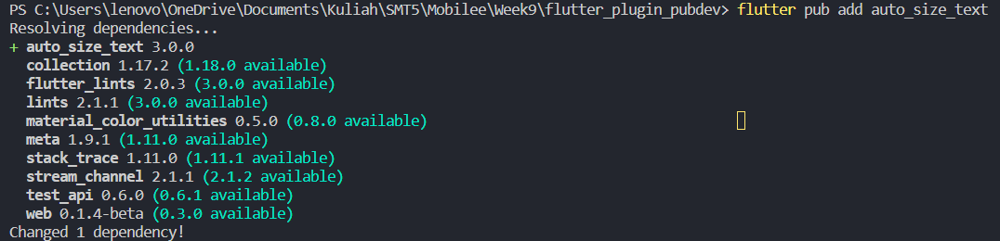
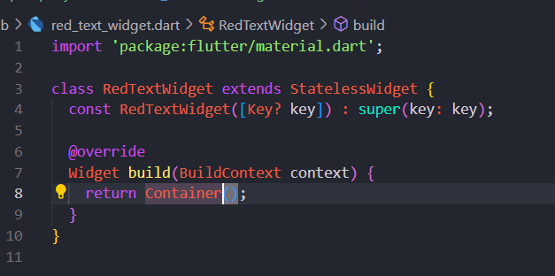
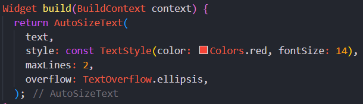
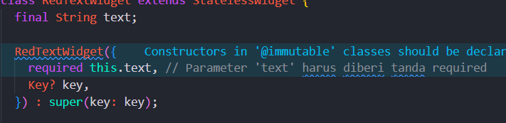
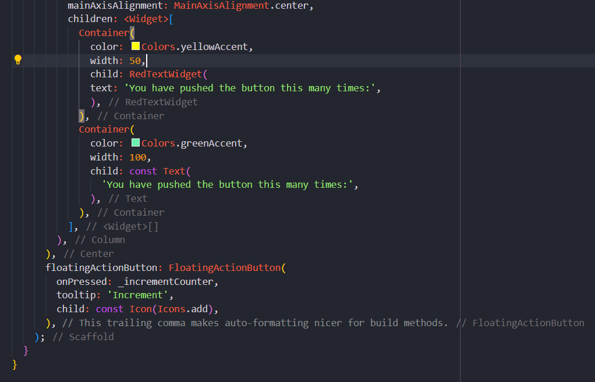
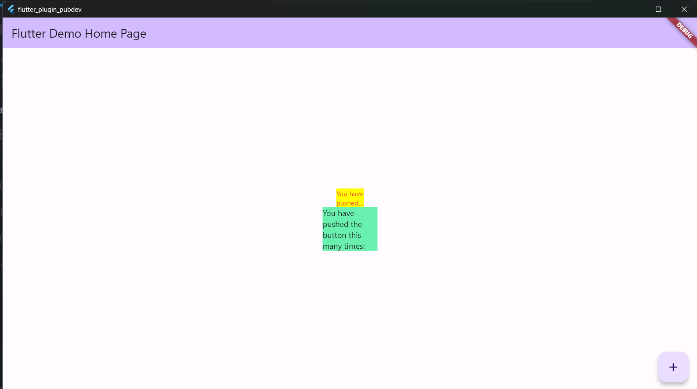

# 7. Praktikum Menerapkan Plugin di Project Flutter
Selesaikan langkah-langkah praktikum berikut ini menggunakan editor Visual Studio Code (VS Code) atau Android Studio atau code editor lain kesukaan Anda.

# Langkah 1: Buat Project Baru
Buatlah sebuah project flutter baru dengan nama flutter_plugin_pubdev. Lalu jadikan repository di GitHub Anda dengan nama flutter_plugin_pubdev.

# Langkah 2: Menambahkan Plugin
Tambahkan plugin auto_size_text menggunakan perintah berikut di terminal

# Langkah 3: Buat file red_text_widget.dart
Buat file baru bernama red_text_widget.dart di dalam folder lib lalu isi kode seperti berikut.

# Langkah 4: Tambah Widget AutoSizeText
Masih di file red_text_widget.dart, untuk menggunakan plugin auto_size_text, ubahlah kode return Container() menjadi seperti berikut.

# Langkah 5: Buat Variabel text dan parameter di constructor
Tambahkan variabel text dan parameter di constructor seperti berikut.

# Langkah 6: Tambahkan widget di main.dart
Buka file main.dart lalu tambahkan di dalam children: pada class _MyHomePageState

# Run

# Jelaskan maksud dari langkah 2 pada praktikum tersebut!
Menggunakan perintah flutter pub add auto_size_text untuk menambahkan plugin pada flutter dan bila berhasil ditambahkan maka akan muncul nama dan versinya di pubspec.

# Jelaskan maksud dari langkah 5 pada praktikum tersebut!
final String text; digunakan untuk mendeklarasikan text.
RedTextWidget({Key? key, required this.text}) : super(key: key); memungkinkan pembuatan widget RedTextWidget dengan menyediakan teks yang akan ditampilkan dan opsionalnya memberikan kunci identifikasi unik.

# Pada langkah 6 terdapat dua widget yang ditambahkan, jelaskan fungsi dan perbedaannya!
Container(
   color: Colors.yellowAccent,
   width: 50,
   child: const RedTextWidget(
             text: 'You have pushed the button this many times:',
          ),
),
Menggunakan widget RedTextWidget yang Anda definisikan sebelumnya.
Menetapkan teks 'You have pushed the button this many times:' ke dalam widget RedTextWidget.
Mengatur latar belakang Container menjadi warna kuning (Colors.yellowAccent).
Mengatur lebar Container menjadi 50.

Container(
    color: Colors.greenAccent,
    width: 100,
    child: const Text(
           'You have pushed the button this many times:',
          ),
)
Menggunakan widget Text yang merupakan widget bawaan Flutter.
Menetapkan teks yang sama, yaitu 'You have pushed the button this many times:', langsung ke dalam widget Text.
Mengatur latar belakang Container menjadi warna hijau (Colors.greenAccent).
Mengatur lebar Container menjadi 100.

# Jelaskan maksud dari tiap parameter yang ada di dalam plugin auto_size_text berdasarkan tautan pada dokumentasi ini !
Maxlines untuk mengontrol jumlah baris maksimum yang dapat digunakan oleh teks dalam widget.\
Overflow mengendalikan bagaimana teks akan ditampilkan dalam widget ketika melebihi batas. 